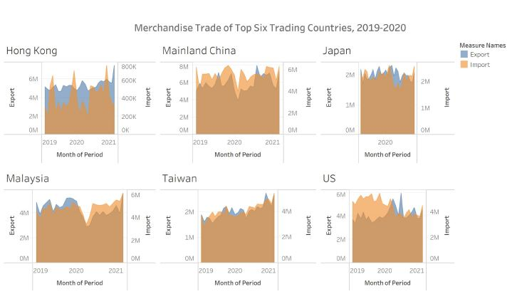
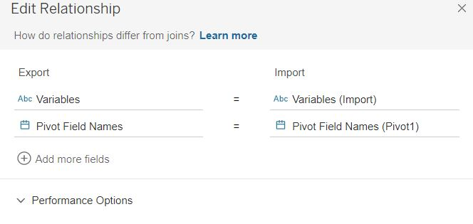
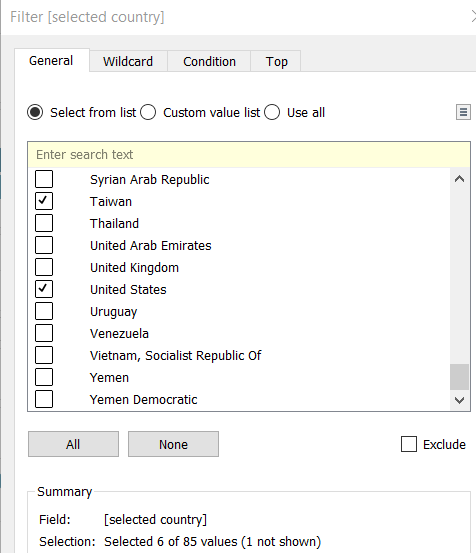
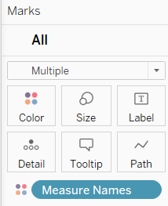
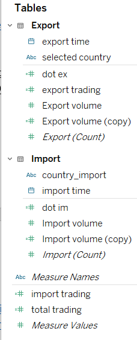
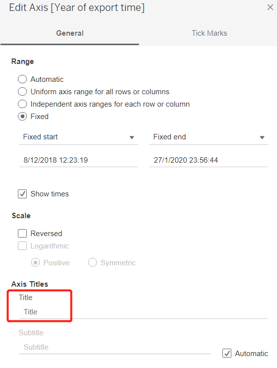
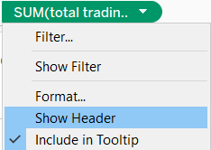

```{r setup, include=FALSE}
knitr::opts_chunk$set(echo = FALSE)
```
# 1.0 Critique of Visualisation 

The original visualisation is shown below.



## 1.1 Clarity 

  1. The title emphasized “Top Six Trading Countries” without explaining how it was calculated whether it ranks by export or import or a total of export and import. Furthermore, Hong Kong belongs to China, so there are only five countries in total.
  2.	The title contained a timeline of 2019 and 2020 but it is inconsistent with the graph. The month of period in Japan only showed 2020 data, lacking data in 2019. In contrast, the rest of the countries in the graph showed from 2019 to 2021. 
  3.	The title of the x-axis “Month of Period” is incorrect as the unit of the x-axis is a year. 
  4.	The scale of Y1 Export axis and Y2 Import axis are different in one country. Therefore, it is hard to compare without scale standardization. For example, the scale of Hong Kong export ranges from 0 million to 6 million while its import ranges from 0 k to 800 k. Furthermore, among different countries, the scale of Y1 Export axis and Y2 Import varies as well. Readers might be misled and compare countries without reading the scale and conclude wrongly.  
  
## 1.2 Aesthetic

  1.	The title emphasized “Top Six Trading Countries” while the graph did not put an individual country in order. For example, Hong Kong is the first country in the chart but it did not have the highest ranking in the view of both import and export.
  2.	Annotations are not used to convey essential insights that readers might miss on. 
  3.	Saturation and contrast between color of export and import is not enough. 

# 2.0 Alternative Design
The proposed design is shown in the following. 


## 2.1 Clarity 
  1. Based on the total dataset given, these 5 countries are not the top trading countries in the world so the title has been changed and name of country Hong Kong becomes Hong Kong China explain why there are total 5 countries. 
  2. Scale of Y-axis is standardized to 0 M to 140 M and there is no secondary y-axis which is reader friendly.
  3. Line graph is used and clearly illustrate trend of import and export trading in 2019 and 2010. Area graph explains to reader about country ranking in terms of total trade.
  
## 2.2 Aesthetic
  1. Annotations are used to emphases key observations. 
  2. Bright and contrastive colors are applied so that readers can focus on their interested category.
  3. Tick marks are not used for categories.

# 3.0 Proposed Visualisation
For a clearer graph, please click the link on Tableau Public here. 

# 4.0	Step-by-step Guide

  1. The timeframe of the dataset covers from 1976 January to 2021 April. As required, only data between 2019 and 2020 were copied and pasted into a new sheet using Microsoft Excel. 


  2. Convert Text to Columns Wizard function was used to separate country names and monetary units. 


  3. Add belonging country name China behind HK so that readers would not take HK as a country in both import and export sheet.


  4.Data of continents were removed because our target variables are countries.


  5.Delete monetary unit column and import the data into Tableau. 


  6.Pivot the table from Jan 2019 to Dec 2020 in both export and import sheet.
  

  7.Build relationship for import and export sheet based on variable names and pivot field name. 
   

  8.Drag variables, pivot field names to columns, measure values (Pivot 1) to rows.
 

  9.Filter variables and select the predefined 6 countries. 
 

  10.Add measure name to the Color side panel to differentiate the import and export in the graph.
  

  11.Remove count of import and export from measure values.
  

  12.Rename all the variables. 
 

  13.Edit title y-axis to trading volume and fix the range of trading volume to 140M. 
  

  14.Similarly, change tick interval of y-xais to 20M. Turn off the minor tick marks.
  

  15.Delete name of x-axis as value of year is shown.
  

  16.Add a new variable called total trade.
  

  17.Drag total trade to secondary y-axis and change type of graph into area.
 

  18.Edit color and of it.
 

  19.Hide header of secondary y-axis.
 

  20.Hide field labels for columns 
 

  21.Rename the worksheet.
 

  22.Use annotations to add insights into the graph.
 

  23.Rank countries in descending order base on total trade. The final dashboard is ready.
 

# 5.0	Derived Insights 

  1. Looking at Import/Export Trading Volume, China had the highest volume in both import and export trading as compared to the rest of the countries in the chart. Mainland China had a marginally increased volume in export. But a slightly decreased volume in import volume. The analysis clearly shows that China had an impressive rebound while the world trade recovered slowly. The main reason was a serious lock-down order was made by the government. After things were well controlled, the business and trading remained as usual. 

[PIEE,2020](https://www.piie.com/blogs/china-economic-watch/china-goes-strength-strength-global-trade)

  2. Large decreases of export trading from 56M to 46M were occurred in Malaysia. And this was caused by the COVID-19 pandemic situation. While the import volume did increase a little. 

[Malaysia External Trade Statistics](https://www.miti.gov.my/miti/resources/Media%20Release/Media_Statement_-_Malaysia_External_Trade_Statistics.pdf)

  3. In United States, a steep decrement of import volume from 59.7M to 48M was appeared due to the result of U.S tariffs imposed on imports from China back in Sep 2019. In contrast the export volume started from 45.3M increased to 54M. 

[Brookings,2020](https://www.brookings.edu/blog/order-from-chaos/2020/08/07/more-pain-than-gain-how-the-us-china-trade-war-hurt-america/)


  4. As for Taiwan, we can concur that both import and export volumes had increased, whereas the import volume had a steeper and larger increment from 44M to 50M. 
  
#### 5.Summary of Total Trading Volume (TTV):
  By comparing the TTV between the year 2019 to 2020, there is a significant difference between Mainland China to the rest of the countries in the chart. Mainland China had the largest TTV of close to 136M. To break down the TTV differences between the year 2019 and 2020, we can clearly observe that Mainland China, United States and Japan were having a slightly decreased volume roughly about 1M to 2M. Malaysia had an obvious declined TTV as the volume dropped from 113M to 103.4M. Both Taiwan and Hong Kong China had an increased volume from 66.5M to 75.2M and 65.3M to 69M respectively. 


